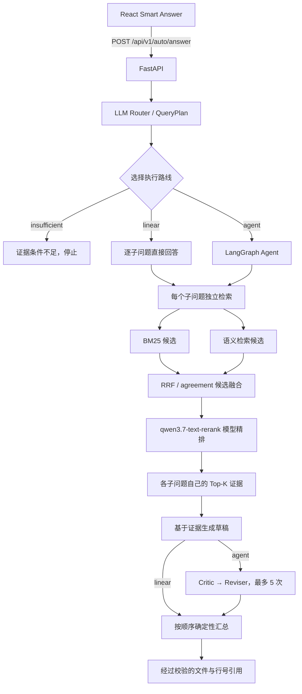

# CodeInsight

> 一个能把回答落到源码文件和行号上的本地代码仓库问答工具。

CodeInsight 用来回答陌生代码仓库里的具体问题。你可以用中文、英文或中英混合提问，它会先拆解问题，再去源码里找证据，最后给出带文件路径和行号的回答。

我不希望模型靠印象解释代码，所以把整个过程拆成了一条可以检查的证据链：

```text
用户问题 → QueryPlan → 代码检索 → 独立证据 → 回答生成 → 文件与行号引用
```
已发布稳定地基版本为 `1.0.0`，当前活跃开发线为 2.0；现在对外仍只保留 Auto Answer 一个入口。2.0 的阶段进度和尚未接入公开入口的能力，以 `docs/STATUS.md` 为准。

## 2.0 当前发布边界

当前是 `release-candidate / partial-pass`，不是已经创建 tag 的正式 Release。Step 8 已完成低成本最小发布 profile，Step 9 已完成本地 Docker Compose 交付切片，Step 10 已完成低成本最终门禁和发布文档收口。完整 Embedding/Provider A/B、真实大并发、SWE-bench resolve、Kubernetes rollout/undo 和更大规模实验统一延期到 `2.1+`；Trivy/SBOM 的 CI 门禁已经通过，正式版本 tag/Release 仍待后续发布决定。

详细验收矩阵见 [`docs/RELEASE_2_0_ACCEPTANCE.md`](docs/RELEASE_2_0_ACCEPTANCE.md)，当前事实入口见 [`docs/STATUS.md`](docs/STATUS.md)。

我目前专注于项目的后端开发，重点是 Python、FastAPI、RAG、检索评测和 LangGraph 工作流。React 前端只用于把后端能力做成一个可以操作的本地演示页面，主要由 Codex 辅助完成；我负责前后端 HTTP API 的边界、接口联调和整体运行流程，不把这个项目当作前端能力展示。


## 为什么做这个项目

当你看陌生仓库时，关键词搜索很难处理中文改写、错别字和跨文件调用。把一大堆代码直接塞给模型也不理想：上下文会很乱，模型还可能编造路径，或者漏掉真正需要的文件。

CodeInsight 把这些步骤拆开处理：

- Router 负责整理问题，并把混合问题拆成最多 8 个可以单独回答的子问题。
- 每个子问题都有自己的候选、Top-K 证据、回答、outcome 和引用，不共用一个大证据池。
- BM25 找代码标识符和精确词面，semantic retrieval 补充语义改写。
- RRF/agreement 合并候选，阿里云 `qwen3.7-text-rerank` 再做模型精排；模型只重排候选，不制造新证据。
- linear 路径直接逐题回答；Agent 路径多一层 Critic-Reviser，最多修改 5 次。
- 模型只能引用 `E1/E2/...` 这类证据编号。文件路径和行号由后端映射，模型不能自己编。

## 当前流程



语义索引以 JSON 缓存在操作系统的本地目录里，不会写进被分析的仓库。没改过的文件可以复用已有向量；Embedding 模型或切块配置改变时，系统会使用新的缓存身份。

## 目前能做什么

- 只读扫描本地仓库，跳过依赖、构建产物和缓存目录。
- 按固定行数切分源码，保留仓库相对路径和从 1 开始的行号。
- 整理多语言问题、识别意图并拆分子问题。
- 使用 BM25 和 semantic 做混合检索。
- 语义索引构建缓存可复用本地 JSON；Qdrant/HNSW 仍是已验证的显式向量后端路径，当前默认应用组装与本次 Rerank 接入不改变其注入边界。
- 使用 RRF/agreement 融合，并调用阿里云 `qwen3.7-text-rerank` 做最终精排；服务失败时直接失败，不回退本地代码排序。
- 每个子问题单独维护证据，最后按 QueryPlan 顺序汇总。
- 同时保留 linear RAG 和有次数上限的 LangGraph Critic-Reviser 路径。
- 约束模型返回结构化结果，并由应用代码映射引用。
- 模型调用统一经过本地 Gateway：默认使用 `deepseek-v4-flash`；遇到可恢复故障时，只降级到能力满足且更便宜的已登记模型，并记录每次 attempt 的价格版本、Token 与原因。
- 代码变更链路支持 Tool Loop 生成多文件 Patch、显式审批、隔离 workspace、固定 pytest Sandbox、检查失败后最多两次重新审批的有限修复，以及异常整体回滚；原仓库不直接写入。
- Workspace、Checkpoint、Approval、ValidationRun、事件和结果可在本地进程重启后恢复；这是本地作品集的持久闭环，不等同于多写者数据库或跨区域高可用。
- 提供 Celery/Redis 固定检查 Worker、公开 Run 事件、OTel span 和 Prometheus 指标端点；Fake Provider 故障测试不作为模型质量结论。
- 提供 CLI、FastAPI 和 React 页面。
- 提供离线单元测试、集成测试和可复现的评测资产。

## 本地运行

### 环境要求

- Python `3.12` or `3.13`
- [uv](https://docs.astral.sh/uv/)
- Node.js `22`
- 一个兼容 OpenAI 接口的聊天模型
- 一个兼容 OpenAI 接口的 Embedding 模型

### 1. 配置模型

参考 `.env.example` 设置环境变量。PowerShell 示例：

```powershell
$env:CODEINSIGHT_API_KEY="<chat-key>"
$env:CODEINSIGHT_MODEL="<chat-model>"
$env:CODEINSIGHT_BASE_URL="<openai-compatible-chat-url>"

$env:CODEINSIGHT_EMBEDDING_API_KEY="<embedding-key>"
$env:CODEINSIGHT_EMBEDDING_MODEL="<embedding-model>"
$env:CODEINSIGHT_EMBEDDING_BASE_URL="<openai-compatible-embedding-url>"
```

密钥只保存在后端进程的环境变量中，不会传给 React 前端，也不会写入仓库。

### 2. 启动本地依赖

```powershell
docker volume create codeinsight-qdrant-data
docker compose up -d --wait mysql redis qdrant
docker compose ps
```

其中第一条命令在新机器上执行一次即可；已有本项目卷时 Docker 会提示已存在，可继续执行。Qdrant 由 008 根目录 Compose 统一管理，使用本项目固定的 6335/6336 端口；不要再从 `ops/qdrant/docker-compose.yml` 单独启动。

### Step 9 本地全栈切片

如需启动 API、双 Gateway、Worker、数据库、Qdrant、Prometheus、Grafana 和 OTel Collector：

```powershell
docker compose -f ops/docker-compose.yml up -d --wait
docker compose -f ops/docker-compose.yml ps
```

本机宿主端口为 API `18000`、Gateway proxy `18010`、Prometheus `19090`、Grafana `13000`。Compose 默认使用 Fake Gateway 做部署契约和故障切换验证，不代表真实模型质量或生产 HA。

## CI/CD

- `CI`：Pull Request 和 `main`/`master` push 触发 Ruff、后端测试、Compose 配置检查、Docker 构建和供应链扫描入口。
- `CD`：`main`/`master` push、`v*` tag 或手动触发时，重新执行发布范围验证，构建版本镜像，并渲染 Kubernetes manifest 作为 Actions artifact。
- `v*` tag 还会把固定 Dockerfile 构建的版本镜像推送到 GHCR，生成版本 tag 和 commit SHA 两类镜像标签。
- 当前 CD 不会在没有集群和环境审批的情况下部署到云端。

工作流文件位于 `.github/workflows/ci.yml` 和 `.github/workflows/cd.yml`。

### 3. 启动后端

```powershell
cd backend
uv sync --locked
uv run uvicorn codeinsight.api.app:app --host 127.0.0.1 --port 8001
```

健康检查地址：`http://127.0.0.1:8001/api/v1/health`

需要独立运行 Step 7 Gateway 与固定检查 Worker 时，再开启两个终端：

```powershell
cd backend
uv run uvicorn codeinsight.infrastructure.gateway_server:app --host 127.0.0.1 --port 8010

# Windows 本地 Worker 使用 solo pool；任务命令来自 validation profile，而非模型文本。
uv run celery -A codeinsight.agent.worker_tasks.celery_app worker --pool=solo --loglevel=INFO
```

Gateway 健康检查、模型清单和指标分别位于 `/health`、`/v1/models`、`/metrics`。

### 4. 启动前端

再打开一个终端：

```powershell
cd frontend
npm.cmd install
npm.cmd run dev
```

浏览器访问 `http://127.0.0.1:5173`。

### 也可以使用 CLI

```powershell
cd backend
uv run codeinsight auto-answer `
  --repo tests/fixtures/sample_repo `
  "用户结账时怎样校验商品编号和数量，之后库存和金额按什么顺序处理？"
```

## HTTP 接口

目前公开两个接口：

- `GET /api/v1/health`
- `POST /api/v1/auto/answer`

请求示例：

```json
{
  "repository_root": "tests/fixtures/sample_repo",
  "question": "用户结账时怎样校验商品编号和数量，之后库存和金额按什么顺序处理？",
  "limit": 5
}
```

响应里会返回 `QueryPlan`、执行路线、逐子问题答案、经过校验的引用、token 用量、Embedding 用量和公开工作流事件，不会返回模型的隐藏推理过程。

## 评测结果

Master-200 一共有 200 个高难问题，覆盖项目 fixture 以及固定版本的 HTTPX、Click 和 Requests。问题里包含中文、英文、中英混合、歧义、错别字和多意图表达。

把长距离证据标注修正为符合产品 80 行切块边界后，结果如下：

| 指标 | Master-200 |
| --- | ---: |
| Outcome 准确率 | 91.50% |
| 引用有效率 | 100.00% |
| 引用精度 | 66.79% |
| 证据召回率 | 86.19% |
| 完整证据覆盖率 | 76.50% |
| 必需术语通过率 | 92.00% |
| 子问题数量准确率 | 90.50% |
| 自动证据约束通过率 | 34.50% |

其中 100 个真实仓库案例的检索漏斗是：

```text
原始候选 98.92%
    ↓
RRF Top-20 95.17%
    ↓
重排后 Top-5 86.42%
    ↓
最终引用 81.17%
```

这些都是自动计算的证据约束指标，不能理解为“人工确认了 91.5% 的回答语义完全正确”。从漏斗看，当前最需要继续改的是最后的证据筛选。

在 Click 8.4.1 上验证持久化索引时，冷启动需要处理 101,866 个仓库代码 Embedding token，热加载时降为 0。每次用户查询本身仍需要调用一次 Embedding。

## 目录结构

```text
backend/               Python 应用、检索、Agent 和测试
frontend/              React + TypeScript 本地页面
docs/assets/           README 使用的产品截图
work/                  本地外部评测仓库，不进入 Git
```

前后端只通过 HTTP JSON 通信。前端不会导入后端源码，后端也不依赖 React 状态。

## 运行检查

后端：

```powershell
cd backend
uv run ruff check src tests
uv run pytest --basetemp=.pytest-release-basetemp
```

前端：

```powershell
cd frontend
npm.cmd run lint
npm.cmd test -- --run
npm.cmd run build
```

自动化测试使用确定性的 fake model 和 fake embedding adapter，不会消耗付费模型额度。


## 后续想做

- 在证据不足时改写查询并重新检索，也就是 Evidence Retrieval Repair Loop。
- 对 `qwen3.7-text-rerank` 的质量收益和代价仍保留为未测试边界；用户已取消原 Rerank A/B 对照。
- Qdrant/HNSW 已由本地 Compose 管理；后续只需做规模交叉点和参数矩阵，不再重复评估“是否引入向量数据库”。历史 local JSON 对照结果保留。
- 增加更多编程语言和 monorepo 场景。
- 如果以后支持远程仓库，再单独设计安全边界。


## 开源许可

CodeInsight 使用 [MIT License](LICENSE)。简单说就是：你可以使用、修改和分发代码，但需要保留版权和许可声明，软件本身不提供担保。
