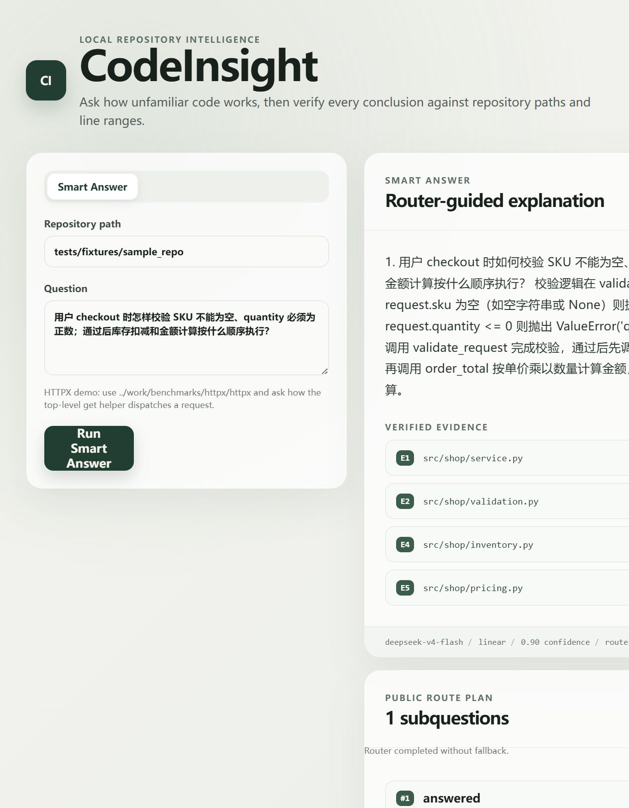
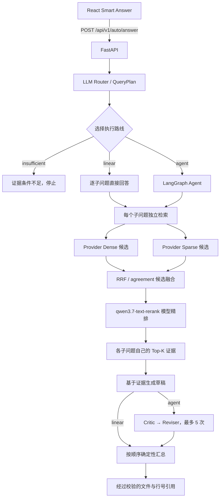

# CodeInsight

> 一个能把回答落到源码文件和行号上的本地代码仓库问答工具。

CodeInsight 用来回答陌生代码仓库里的具体问题。你可以用中文、英文或中英混合提问，它会先拆解问题，再去源码里找证据，最后给出带文件路径和行号的回答。

我不希望模型靠印象解释代码，所以把整个过程拆成了一条可以检查的证据链：

```text
用户问题 → QueryPlan → 代码检索 → 独立证据 → 回答生成 → 文件与行号引用
```
当前工作树正在进行 `2.1.0` Q1–Q5 升级；`2.0.3` 仍是上一版正式 Release。
本次升级把默认检索切换为 Provider Dense/Sparse + Qdrant Named Vectors，增加可控的
RepositoryMap 分页导航和 LSP/SCIP 只读工具。升级边界与未验证项见
[`docs/RELEASE_2_1_0_Q1_Q5.md`](docs/RELEASE_2_1_0_Q1_Q5.md)。

## 2.0 当前发布边界

`2.0.3` 是正式 Release，不是 pre-release。它在 v2.0.2 基础上补齐了普通聊天与业务范围边界、自然引导、开发调试策略和统一对话回归验证。真实大并发、SWE-bench resolve、Kubernetes rollout/undo 和更大规模实验仍不在本版本承诺内。

当前公开能力见 [`docs/CAPABILITIES.md`](docs/CAPABILITIES.md)，最小演示见 [`docs/DEMO.md`](docs/DEMO.md)，验收摘要见 [`docs/EVALUATION_SUMMARY.md`](docs/EVALUATION_SUMMARY.md)。

## 2.0.3 Conversation 能力

统一 `/api/v2/chat/*` 入口先由业务编排层决定本轮任务，再选择执行路线：

| 任务类型 | 处理方式 | 用户可见结果 |
| --- | --- | --- |
| `general_chat` | Session 上下文 + 普通文本 Prompt + Gateway | 一份自然语言 `assistant_message` |
| `scope_redirect` | 确定性范围引导，不调用模型、不访问仓库 | 自然承接后引导回代码任务 |
| `explain` | Query Router + Dense/Sparse/Rerank + 证据回答 | 一份代码解释，引用和用量在详情中 |
| `change` | Tool Loop + diff 预览 + approval + 隔离校验 | 修改结果或等待审批，不越过既有门禁 |
| `clarify` | 返回可执行的澄清问题 | 不扫描仓库、不调用修改工具 |

`general_chat` 不再被强制套用代码问答的 JSON response format；已绑定 Session 后，普通聊天和澄清也不会重新扫描仓库。代码回答的自然语言正文只放在 `assistant_message`，`result` 只保留 `kind`、引用、模型、Router、缓存、usage 和变更详情，避免前端把同一答案显示两次。普通聊天仍通过同一个 Gateway，因此模型、降级链、延迟和缓存字段可以和代码路径统一观测。

我目前专注于项目的后端开发，重点是 Python、FastAPI、RAG、检索评测和 LangGraph 工作流。React 前端只用于把后端能力做成一个可以操作的本地演示页面，主要由 Codex 辅助完成；我负责前后端 HTTP API 的边界、接口联调和整体运行流程，不把这个项目当作前端能力展示。



## 为什么做这个项目

当你看陌生仓库时，关键词搜索很难处理中文改写、错别字和跨文件调用。把一大堆代码直接塞给模型也不理想：上下文会很乱，模型还可能编造路径，或者漏掉真正需要的文件。

CodeInsight 把这些步骤拆开处理：

- Router 负责整理问题，并把混合问题拆成最多 8 个可以单独回答的子问题。
- 每个子问题都有自己的候选、Top-K 证据、回答、outcome 和引用，不共用一个大证据池。
- Provider Dense 和 Provider Sparse 分别召回语义与稀疏候选；RRF 融合后再做模型精排。
- RRF/agreement 合并候选，阿里云 `qwen3.7-text-rerank` 再做模型精排；模型只重排候选，不制造新证据。
- linear 路径直接逐题回答；Agent 路径多一层 Critic-Reviser，最多修改 5 次。
- 模型只能引用 `E1/E2/...` 这类证据编号。文件路径和行号由后端映射，模型不能自己编。

## 当前流程



Conversation 的业务编排位于同一 API 入口之后：

```text
用户消息 → Session 恢复 → 意图分类
                     ├─ general_chat → 普通文本模型 → assistant_message
                     ├─ scope_redirect → 范围引导模板 → assistant_message
                     ├─ clarify     → 澄清回答
                     ├─ explain     → Query Router → 检索/证据 → assistant_message
                     └─ change      → Tool Loop → diff/approval/Sandbox
```

向量与索引生命周期由 Qdrant 管理，不写本地向量 JSON，也不写进被分析的仓库。应用内只保留当前请求所需的源码证据映射；Embedding 模型或切块配置改变时，通过新的 Qdrant collection 和 alias 身份隔离。

## 目前能做什么

- 只读扫描本地仓库，跳过依赖、构建产物和缓存目录。
- 按固定行数切分源码，保留仓库相对路径和从 1 开始的行号。
- 整理多语言问题、识别意图并拆分子问题。
- 默认使用 Provider Dense + Provider Sparse，在 Qdrant Named Vectors 中存取向量；不存在本地向量检索回退。
- Qdrant collection 通过 staging、payload/fingerprint 校验和 active/previous alias 发布；开发环境无 URL 时仅使用 Qdrant 进程内模式。
- 使用 RRF/agreement 融合，并调用阿里云 `qwen3.7-text-rerank` 做最终精排；服务失败时直接失败，不回退本地代码排序。
- 每个子问题单独维护证据，最后按 QueryPlan 顺序汇总。
- 同时保留 linear RAG 和有次数上限的 LangGraph Critic-Reviser 路径。
- 约束模型返回结构化结果，并由应用代码映射引用。
- 聊天模型调用经过本地 Gateway；Embedding 与 Rerank 是独立适配器，不能据此宣称所有模型调用都统一经过 Gateway。
- 代码变更链路支持 Tool Loop 生成多文件 Patch、显式审批、隔离 workspace、固定 pytest Sandbox、检查失败后最多两次重新审批的有限修复，以及异常整体回滚；原仓库不直接写入。
- Workspace、Checkpoint、Approval、ValidationRun、事件和结果可在本地进程重启后恢复；这是本地作品集的持久闭环，不等同于多写者数据库或跨区域高可用。
- 提供 Celery/Redis 固定检查 Worker、公开 Run 事件、OTel span 和 Prometheus 指标端点；Fake Provider 故障测试不作为模型质量结论。
- 提供 `auto-answer` CLI、FastAPI 和 React Conversation 页面；同一 Session 可交错普通聊天、代码理解和修改，`clarify` 不会强行进入代码检索。
- Conversation 前端只展示一份 `assistant_message`；代码引用、模型/降级链、缓存、usage、事件和 reasoning 位于可展开的运行详情中。业务外闲聊进入 `scope_redirect`，保留 Session 但不调用模型或仓库工具。
- 提供 `change-demo` 无模型的隔离变更契约演示。
- 提供离线单元测试、集成测试和可复现的评测资产。

## 本地运行

### 环境要求

- Python `3.12` or `3.13`
- [uv](https://docs.astral.sh/uv/)
- Node.js `22`
- 一个兼容 OpenAI 接口的聊天模型
- 一个兼容 OpenAI 接口的 Embedding 模型；如启用默认 Rerank，还需兼容的 Rerank 接口

### 1. 配置模型

参考 `.env.example` 设置环境变量。PowerShell 示例：

```powershell
$env:CODEINSIGHT_API_KEY="<chat-key>"
$env:CODEINSIGHT_MODEL="<chat-model>"
$env:CODEINSIGHT_BASE_URL="<openai-compatible-chat-url>"
# reasoning 与最终结构化回答共用输出额度，默认 40960；可按 Provider 调整
# $env:CODEINSIGHT_MAX_OUTPUT_TOKENS="40960"
# 可选：当前聊天端点确实支持的备用模型；不填则关闭自动降级
# $env:CODEINSIGHT_FALLBACK_MODELS="<same-provider-model>,<same-provider-model-2>"

$env:CODEINSIGHT_EMBEDDING_API_KEY="<embedding-key>"
$env:CODEINSIGHT_EMBEDDING_MODEL="<embedding-model>"
$env:CODEINSIGHT_EMBEDDING_BASE_URL="<openai-compatible-embedding-url>"
```

密钥只保存在后端进程的环境变量中，不会传给 React 前端，也不会写入仓库。

修改对话会在模型生成补丁前检查 Docker Sandbox；如果校验环境不可用，页面会直接说明
阻塞原因。若已批准补丁只是因为 Sandbox 临时故障而进入 `REVIEW_REQUIRED`，同一 Session
输入“继续”会重新校验已有隔离 workspace，不会重复生成相同补丁。

### 本地开发调试模式

当前 2.1.0 开发栈可以显式打开两个只面向本地调试的便利开关：自动确认修改预览，
以及在 Docker 校验环境不可用时跳过固定校验；修改探索会放宽为 12 步、96 次工具调用、
同类工具错误 5 次，但仍有 120 秒总 deadline。它们不会关闭隔离 workspace、路径与基线
校验、补丁范围限制、检查产物指纹、危险工具拦截或敏感文件过滤；跳过校验也会在结果中
明确标记为“未执行”，不会伪装成校验通过。

```powershell
$env:CODEINSIGHT_ENV="development"
$env:CODEINSIGHT_DEV_MODE="1"
$env:CODEINSIGHT_DEV_AUTO_APPROVE="1"
$env:CODEINSIGHT_DEV_SKIP_SANDBOX_VALIDATION="1"
```

`ops/docker-compose.yml` 已将这组开关配置为本地开发栈默认值；正式部署必须设置
`CODEINSIGHT_ENV=production`，生产环境会强制关闭这些开关，即使环境变量误带过去也不会
自动审批或跳过校验。关闭开发模式后，原来的人工审批和 Docker 固定校验流程自动恢复。

### 2. 启动本地依赖

```powershell
docker volume create codeinsight-qdrant-data
docker compose up -d --wait mysql redis qdrant
docker compose ps
```

其中第一条命令在新机器上执行一次即可；已有本项目卷时 Docker 会提示已存在，可继续执行。Qdrant 由 008 根目录 Compose 统一管理，使用本项目固定的 6335/6336 端口；不要再从 `ops/qdrant/docker-compose.yml` 单独启动。仅运行 Auto Answer 的本地单测和 fake 流程不要求启动这些依赖。

### Step 9 本地全栈切片

如需启动 API、双 Gateway、Worker、数据库、Qdrant、Prometheus、Grafana 和 OTel Collector：

```powershell
docker compose -f ops/docker-compose.yml up -d --wait
docker compose -f ops/docker-compose.yml ps
```

本机宿主端口为 API `18000`、Gateway proxy `18010`、Prometheus `19090`、Grafana `13000`。Compose 默认使用 Fake Gateway 做部署契约和故障切换验证，不代表真实模型质量或生产 HA。

## CI/CD

- `CI`：Pull Request 和 `main`/`master` push 触发 Ruff、后端测试、Compose 配置检查、Docker 构建和供应链扫描入口。
- `CD`：`main`/`master` push、`v*` tag 或手动触发时，重新执行发布范围验证，构建版本镜像，并渲染 Kubernetes manifest 作为 Actions artifact。
- `v*` tag 还会把固定 Dockerfile 构建的版本镜像推送到 GHCR，生成版本 tag 和 commit SHA 两类镜像标签。
- 当前 CD 不会在没有集群和环境审批的情况下部署到云端。

工作流文件位于 `.github/workflows/ci.yml` 和 `.github/workflows/cd.yml`。

版本分支、主工作树和临时 worktree 的生命周期规则见 [`CONTRIBUTING.md`](CONTRIBUTING.md) 的“分支与工作树生命周期”。

### 3. 启动后端

```powershell
cd backend
uv sync --locked
uv run uvicorn codeinsight.api.app:app --host 127.0.0.1 --port 8001
```

健康检查地址：`http://127.0.0.1:8001/api/v1/health`

需要独立运行 Step 7 Gateway 与固定检查 Worker 时，再开启两个终端：

```powershell
cd backend
uv run uvicorn codeinsight.infrastructure.gateway_server:app --host 127.0.0.1 --port 8010

# Windows 本地 Worker 使用 solo pool；任务命令来自 validation profile，而非模型文本。
uv run celery -A codeinsight.agent.worker_tasks.celery_app worker --pool=solo --loglevel=INFO
```

Gateway 健康检查、模型清单和指标分别位于 `/health`、`/v1/models`、`/metrics`。

Gateway 用量汇总和最近调用明细分别位于 `/v1/usage/summary`、`/v1/usage/calls`。主 API 也提供 `/api/v1/usage/summary`、`/api/v1/usage/calls`，前端通过它们读取实际承载 Auto Answer 的同一进程记录。明细只包含模型、路由、Token、缓存、成本、延迟、错误类别和不可逆请求指纹，不返回原始 prompt、工具参数、模型正文或隐藏推理。字段来源和 cache write 边界见 [`docs/OBSERVABILITY.md`](docs/OBSERVABILITY.md)。

### 4. 启动前端

再打开一个终端：

```powershell
cd frontend
npm.cmd install
npm.cmd run dev
```

浏览器访问 `http://127.0.0.1:5173`。

### 也可以使用 CLI

```powershell
cd backend
uv run codeinsight auto-answer `
  --repo tests/fixtures/sample_repo `
  "用户结账时怎样校验商品编号和数量，之后库存和金额按什么顺序处理？"
```

## HTTP 接口

目前公开接口：

- `GET /api/v1/health`
- `POST /api/v1/auto/answer`
- `GET /api/v1/usage/summary`
- `GET /api/v1/usage/calls`
- `POST /api/v2/chat/sessions`
- `POST /api/v2/chat/turns`
- `GET /api/v2/chat/turns/{turn_id}/events`

请求示例：

```json
{
  "repository_root": "tests/fixtures/sample_repo",
  "question": "用户结账时怎样校验商品编号和数量，之后库存和金额按什么顺序处理？",
  "limit": 5
}
```

Auto Answer 响应里会返回 `QueryPlan`、执行路线、逐子问题答案、经过校验的引用、token 用量、Embedding 用量和公开工作流事件。统一对话接口支持 SSE 阶段事件；调试请求可以显示供应商明确返回的 reasoning 字段，但该字段不写入持久化事件。

变更闭环 API 位于 `/api/v2/change/preview`、`approve`、`apply`、`rollback`，以及按 Run 查询结果和事件的接口。它只写入受管控 workspace；请先运行 `codeinsight change-demo --work-dir <目录>` 查看固定样例。

## 历史评测结果

以下数字来自 2026-08-13 的旧检索流水线记录，不代表当前 qwen Rerank 接入后的质量，也没有在本轮重新运行。

把长距离证据标注修正为符合产品 80 行切块边界后，结果如下：

| 指标 | Master-200 |
| --- | ---: |
| Outcome 准确率 | 91.50% |
| 引用有效率 | 100.00% |
| 引用精度 | 66.79% |
| 证据召回率 | 86.19% |
| 完整证据覆盖率 | 76.50% |
| 必需术语通过率 | 92.00% |
| 子问题数量准确率 | 90.50% |
| 自动证据约束通过率 | 34.50% |

其中 100 个真实仓库案例的检索漏斗是：

```text
原始候选 98.92%
    ↓
RRF Top-20 95.17%
    ↓
重排后 Top-5 86.42%
    ↓
最终引用 81.17%
```

这些都是自动计算的证据约束指标，不能理解为“人工确认了 91.5% 的回答语义完全正确”。从漏斗看，当前最需要继续改的是最后的证据筛选。

在 Click 8.4.1 上验证持久化索引时，冷启动需要处理 101,866 个仓库代码 Embedding token，热加载时降为 0。每次用户查询本身仍需要调用一次 Embedding。

## 目录结构

```text
backend/               Python 应用、检索、Agent 和测试
frontend/              React + TypeScript 本地页面
docs/assets/           README 使用的产品截图
work/                  本地外部评测仓库，不进入 Git
```

前后端只通过 HTTP JSON 通信。前端不会导入后端源码，后端也不依赖 React 状态。

## 运行检查

后端：

```powershell
cd backend
uv run ruff check src tests
uv run python -m pytest --basetemp=.pytest-release-basetemp
```

前端：

```powershell
cd frontend
npm.cmd run lint
npm.cmd test -- --run
npm.cmd run build
```

自动化测试使用确定性的 fake model 和 fake embedding adapter，不会消耗付费模型额度。


## 后续想做

- 在证据不足时改写查询并重新检索，也就是 Evidence Retrieval Repair Loop。
- 对 `qwen3.7-text-rerank` 的质量收益和代价仍保留为未测试边界；用户已取消原 Rerank A/B 对照。
- Qdrant/HNSW 已由本地 Compose 管理；后续只需做规模交叉点和参数矩阵，不再重复评估“是否引入向量数据库”。历史后端对照结果仍作为演进证据保留。
- 增加更多编程语言和 monorepo 场景。
- 如果以后支持远程仓库，再单独设计安全边界。


## 开源许可

CodeInsight 使用 [MIT License](LICENSE)。简单说就是：你可以使用、修改和分发代码，但需要保留版权和许可声明，软件本身不提供担保。
